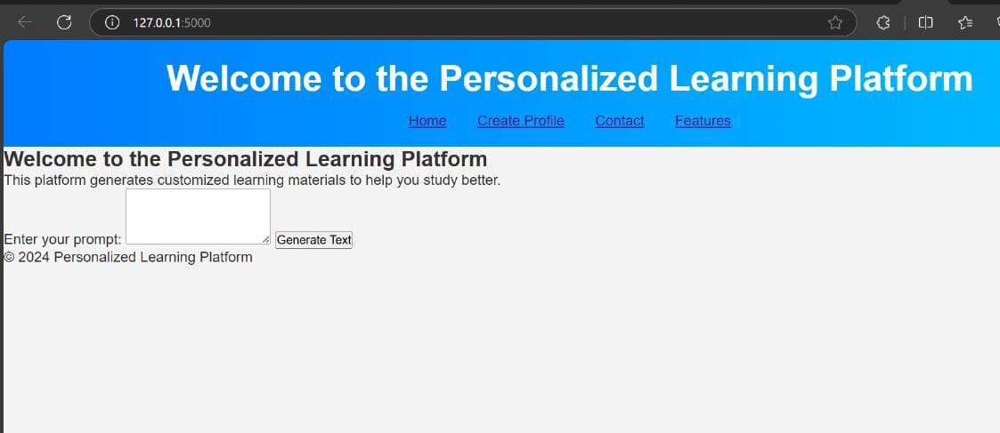
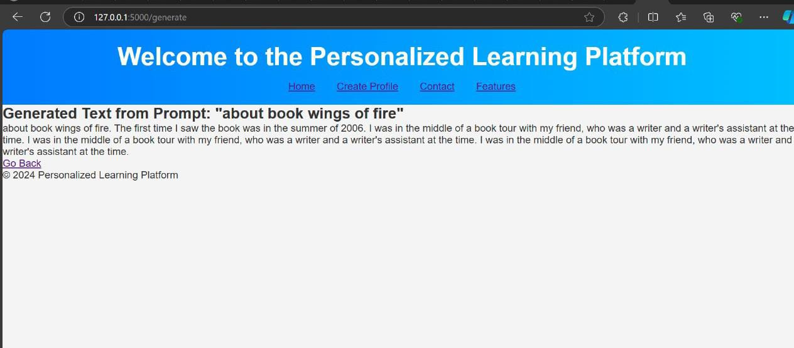
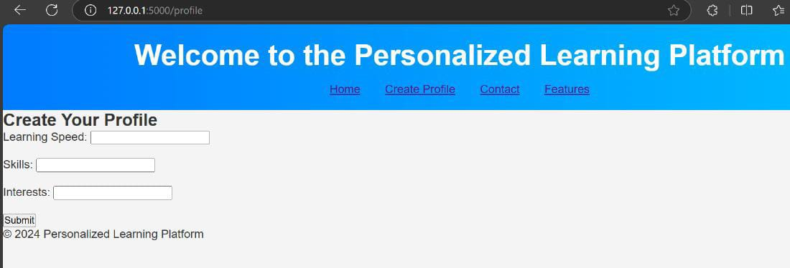
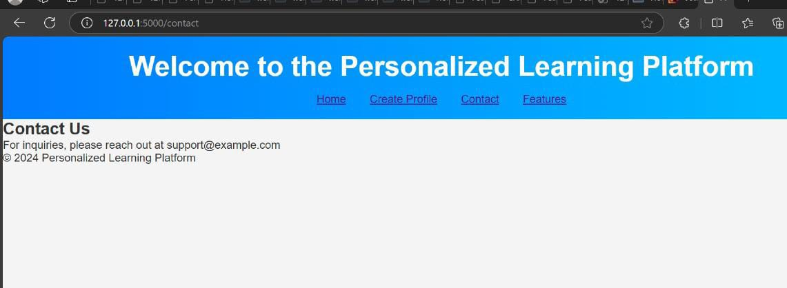
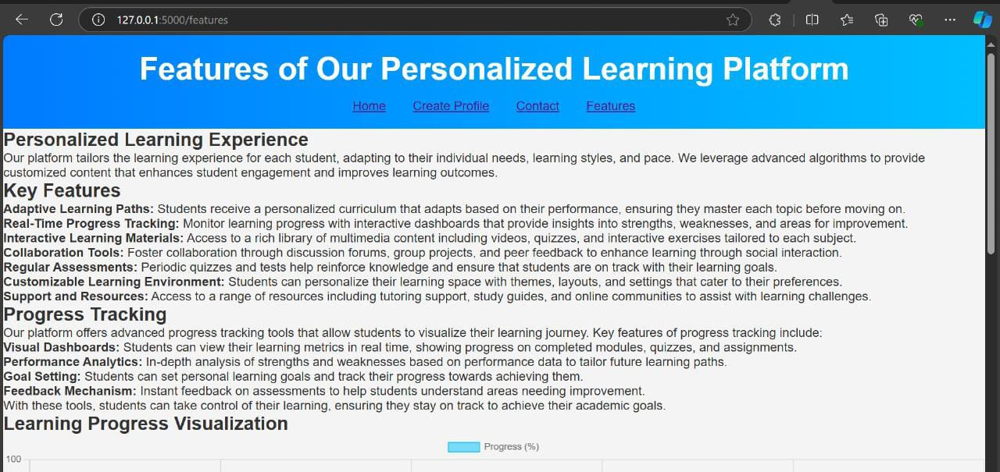
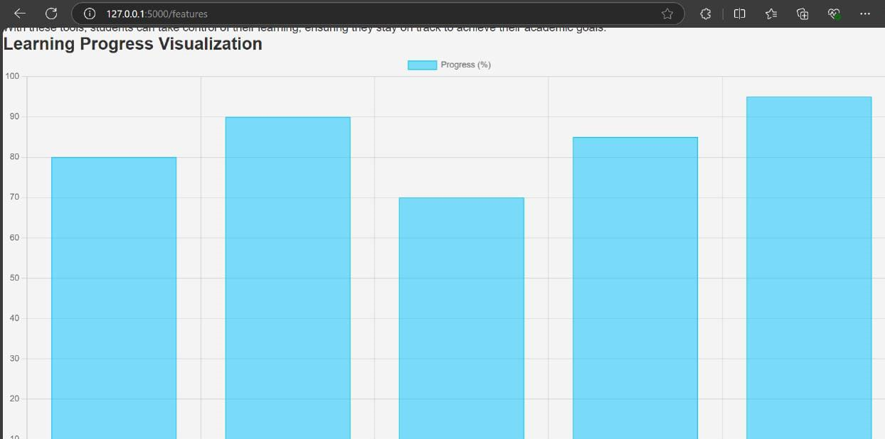
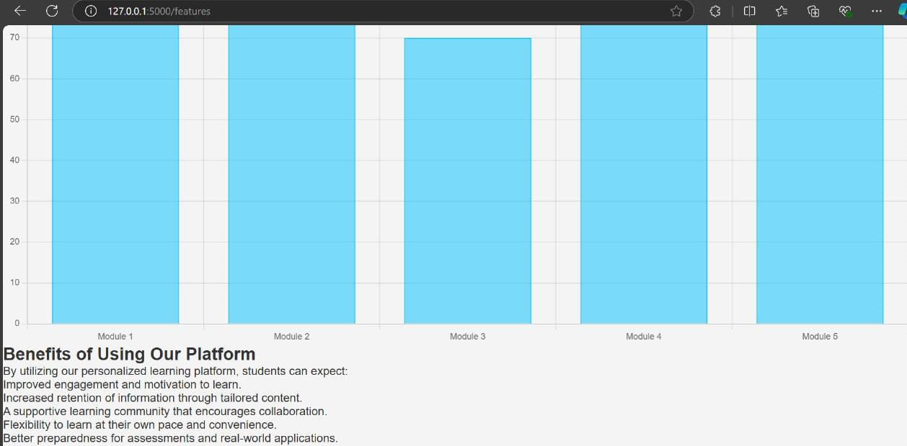

Personalized Learning Platform with GPT-2

This project is a web-based personalized learning platform that provides students with an adaptive learning experience. It includes features such as real-time progress tracking, interactive learning materials, and personalized content generation using the GPT-2 model. Built using Flask for the backend, the platform offers customized content that enhances student engagement and learning outcomes.

Features

Adaptive Learning Paths: Personalized curriculum adapts based on student performance.

Real-Time Progress Tracking: Track learning progress via interactive dashboards.

Interactive Learning Materials: Rich multimedia content including quizzes and videos.

GPT-2 Model Integration: Personalized content generation based on the student's learning patterns.

Collaboration Tools: Students can collaborate via discussion forums and peer feedback.

Goal Setting & Learning Insights: Allows students to set learning goals and track insights into their progress.

Technology Stack

Flask: Backend framework to handle routing and data management.

GPT-2 Model: Natural language processing for personalized content generation.

HTML5/CSS3: Used for frontend structure and styling.

JavaScript: For frontend interactivity and dynamic content rendering.

Chart.js: For visualizing progress tracking using bar charts.

Installation

Clone the Repository
Clone the repository to your local machine using Git:

git clone https://github.com/yourusername/personalized-learning-platform.git

Set up a Virtual Environment
Navigate to the project directory and create a virtual environment to manage project dependencies.

cd personalized-learning-platform python3 -m venv venv source venv/bin/activate # On Windows, use venv\Scripts\activate

Install Dependencies
Install the necessary dependencies by running:

pip install -r requirements.txt

Your requirements.txt should contain the following:

Flask==2.0.1 transformers==4.20.1 torch==1.10.0 chart.js==2.9.4

Download GPT-2 Model
The project uses the GPT-2 model from Hugging Face’s transformers library. You'll need to download the model and tokenizer:

from transformers import GPT2LMHeadModel, GPT2Tokenizer

tokenizer = GPT2Tokenizer.from_pretrained('gpt2') model = GPT2LMHeadModel.from_pretrained('gpt2')

Ensure this code is added in the relevant parts of your Flask app where GPT-2 will be utilized for generating personalized content.

Run the Flask Application
To start the application, use the following command:

export FLASK_APP=app.py # On Windows, use set FLASK_APP=app.py flask run

Once the server is running, open your browser and navigate to http://127.0.0.1:5000/ to view the platform.

Usage

Progress Tracking: Navigate to the "Progress Tracking" section to visualize your learning journey with bar charts powered by Chart.js.

Personalized Content: GPT-2 generates customized learning materials based on your individual learning pace and patterns.

Collaborate: Use discussion forums and group projects to enhance the social learning experience.

Customizable Dashboard: Each user can customize their learning environment based on their preferences.

Screenshots

How GPT-2 is Used

The GPT-2 model is used in this platform to generate personalized content for students based on their learning patterns and progress. This helps in creating an adaptive learning path suited to the individual’s pace and needs.

Built With

Flask: A lightweight web framework for handling routing, views, and API endpoints.

GPT-2: A natural language processing model used for generating personalized learning content.

HTML/CSS/JavaScript: Frontend development for creating interactive and responsive layouts.

Chart.js: A JavaScript library for rendering charts and visualizations for progress tracking.